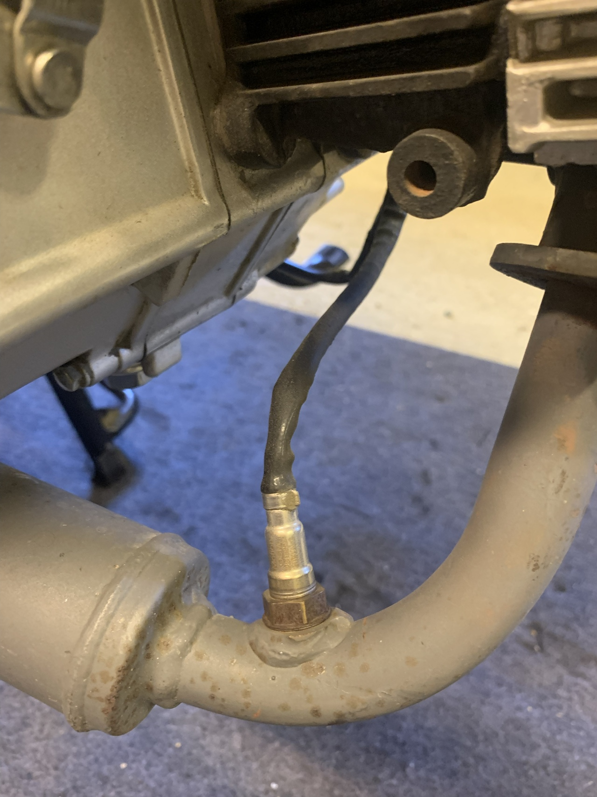

# Avgassystem

Avgassystemet ska kontrolleras efter skador, läckage, korrosion och lösa infästningar.

## Visuell kontroll

Kontrollera hela avgassystemet från cylindern till ljuddämparen.

Leta efter:

* kraftig rost eller korrosion
* sprickor eller hål
* bucklor eller andra skador
* lösa eller saknade skruvar och muttrar
* skadade eller lösa fästen
* skadad eller lös värmesköld

Ytrost behöver inte innebära att avgassystemet behöver bytas, men kraftig rost bör undersökas närmare för att kontrollera att godset inte blivit försvagat.

## Kontrollera efter avgasläckage

Starta motorn och lyssna efter ovanliga puffande, fräsande eller skarpa avgasljud.

Kontrollera särskilt:

* anslutningen mellan avgasrör och topplock
* skarvar i avgassystemet
* svetsfogar
* ljuddämparen

Svarta sotspår runt en skarv kan vara ett tecken på att avgaser läcker ut där.

!!! warning "Varmt avgassystem"
Avgassystemet blir mycket varmt under körning. Undvik att röra avgasrör, ljuddämpare och lambdasond när motorn är varm.

## Infästningar

Med motorn avstängd och avgassystemet kallt:

1. Kontrollera att avgasröret sitter stadigt vid motorn.
2. Kontrollera ljuddämparens infästningar.
3. Känn försiktigt efter om avgassystemet eller värmeskölden sitter löst.
4. Kontrollera efter sprickor runt fästpunkterna.

Avgassystemet ska sitta stadigt utan att kunna slå mot ram eller andra komponenter.

## Lambdasond

Romet Ogar 202 FI Euro 5 har en lambdasond monterad i avgassystemet.

Kontrollera:

* att lambdasonden sitter ordentligt
* att kabeln inte är skadad eller smält
* att kabeln inte ligger mot det heta avgassystemet
* att kontakten och kabeldragningen ser hela ut

Lambdasonden används av insprutningssystemet för att mäta syrehalten i avgaserna och påverkar motorns bränslereglering.

