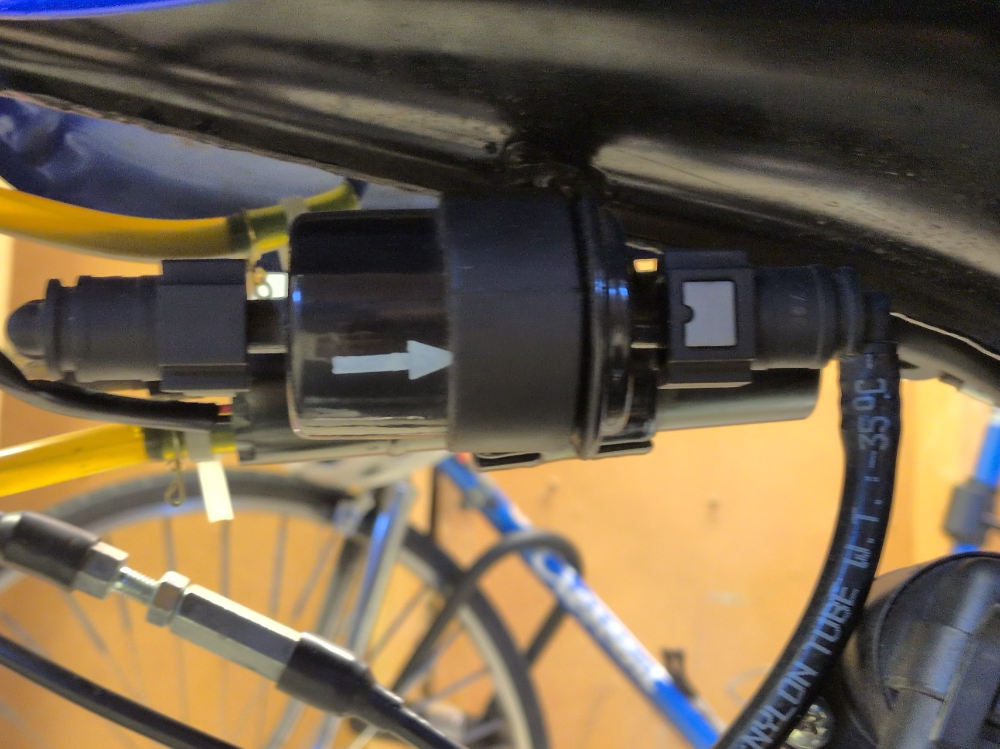

# Bränslefilter

Romet Ogar 202 Euro 5 har ett inline-bränslefilter i bränsleslangen. Filtret har en markerad flödesriktning som ska följas vid montering.

## Inspektion

Kontrollera: filtret, slangar samt slangklämmorna.

## Byte

!!! warning "Brandfarligt bränsle"
Arbeta med kall motor på en välventilerad plats. Undvik öppen låga, gnistor och andra antändningskällor.

### Demontering och montering
Bränslesystemet har en elektrisk bränslepump. Att stänga bränslekranen innebär därför inte nödvändigtvis att allt tryck eller bränsle försvinner ur ledningen. Ha trasa eller lämpligt kärl till hands för det bränsle som finns kvar i slang och filter.

1. stäng bränslekranen.
2. Ta bort det gamal filtret.
3. Montera det nya filtret åt samma håll som det gamla.
4. Öppna bränslekranen igen.

## Efter byte

1. Slå på tändningen så att bränslepumpen kan bygga upp tryck.
2. Kontrollera filtret, slangarna och anslutningarna noggrant efter läckage.
3. Starta motorn.
4. Kontrollera återigen att inget bränsle läcker.

