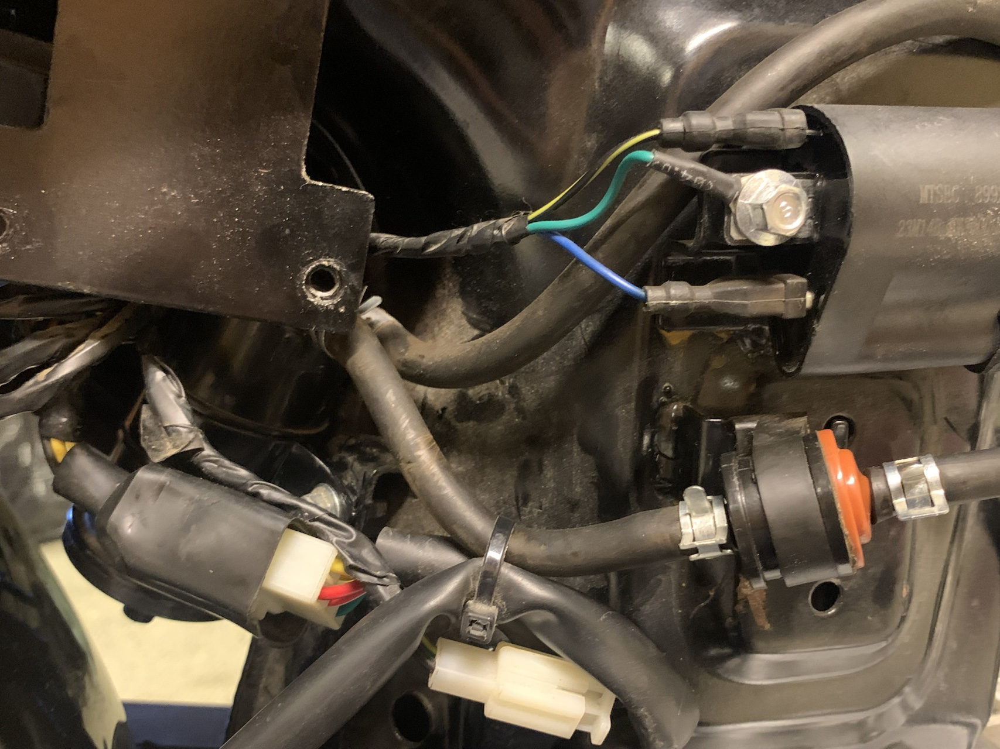
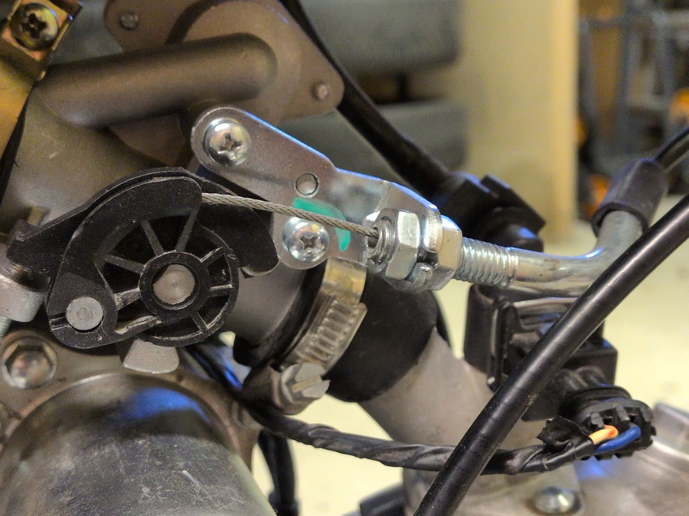

# Bränslesystem / tomgång

Kontrollen omfattar bränslesystemets slangar och anslutningar samt att motorn har en stabil tomgång och reagerar normalt på gaspådrag.

## Bränslesystem

Kontrollera visuellt:

* att slangar och anslutningar sitter ordentligt och inte är skadade
* att bränslekranen går att manövrera
* att synliga elektriska anslutningar till bränslesystemet sitter ordentligt

Kontroll och byte av själva bränslefiltret beskrivs separat under **Bränslefilter**.

## EVAP-system

Euro 5-versionen har ett EVAP system för hantering av bränsleångor.

Kontrollera efter skador och dylikt.

## Kontroll av tomgång

Kontrollen bör göras med motorn uppvärmd till normal arbetstemperatur.

1. Starta motorn.
2. Låt den gå utan att hålla i gasen.
3. Kontrollera att motorn fortsätter gå på tomgång.
4. Lyssna efter tydligt ojämn eller vandrande tomgång.
5. Ge ett mindre gaspådrag.
6. Släpp gasen och kontrollera att motorn återgår till stabil tomgång.
7. Upprepa några gånger.

Tomgången bör vara tillräckligt stabil för att motorn inte ska stanna och motorn ska återgå till tomgång efter gaspådrag.

## Gasreglage

Kontrollera att:

* gashandtaget rör sig jämnt utan att kärva
* handtaget återgår snabbt och helt när det släpps
* vajer och anslutningar sitter ordentligt och inte är skadade
* motorns tomgång inte påverkas när styret vrids fullt åt höger eller vänster
* att vajern är lagom spänd. Ingen gas vid normalläget och inget stort spel innan gasen aktiveras. Se bilden nedan för vart vajerns spänning justeras

