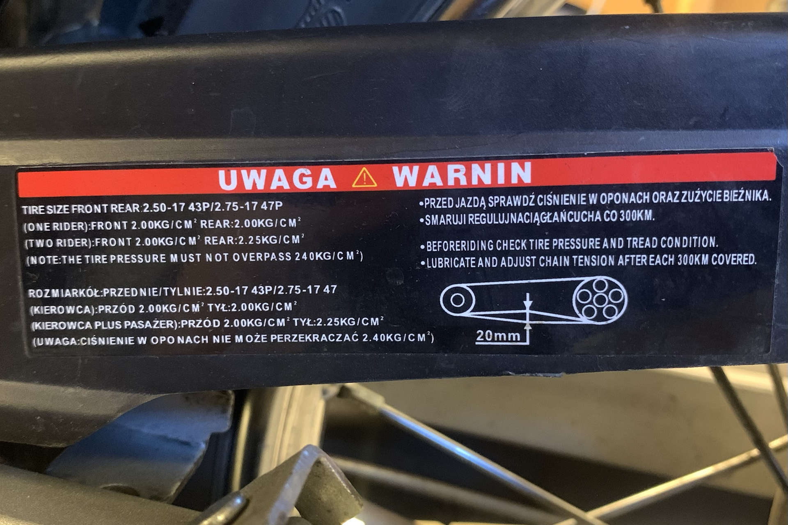

# Kedja

Här beskrivs kontroll, rengöring, smörjning och justering av drivkedjan på
**Romet Ogar 202, årsmodell 2022**.

Kedjan ska rengöras från smuts och grus ungefär
var 14:e dag och hållas inoljad. Kedjespelet ska vara **15–25 mm**.

## Rengöring

Det finns flera metoder för att rengöra en drivkedja.

WD-40 eller 5-56 fungerar bra för att lösa smuts och gammal olja.
Applicera på kedjan och torka därefter ren med en trasa.

Undvik att få rengöringsmedel på däck eller in i bromstrummorna.

## Smörjning

Efter rengöring ska kedjan smörjas.

Motorolja fungerar som ett enkelt smörjmedel och finns redan tillgänglig
vid övrig service av mopeden. Applicera en liten mängd på kedjans länkar,
exempelvis med en doseringsspruta, och torka därefter bort överflödig olja.
