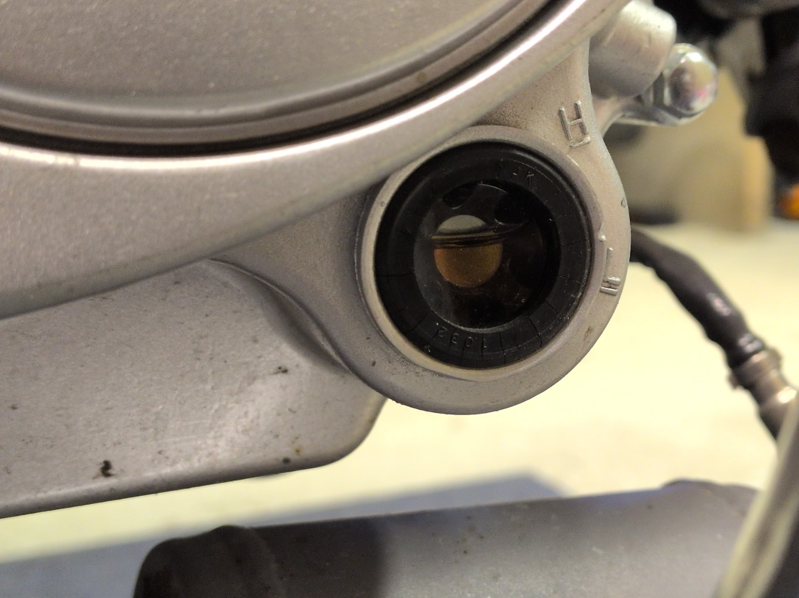

# Motorolja

Här beskrivs kontroll och byte av motorolja på **Romet Ogar 202, årsmodell 2022**.

Använd **10W-40 motorcykelolja avsedd för våtkoppling**, exempelvis olja klassad enligt JASO MA eller MA2.

## Kontrollera efter oljeläckage

Inspektera motorn efter färsk motorolja, särskilt runt:

* avtappningsplugg
* oljepåfyllning
* ventilkåpor
* motorkåpor och skarvar
* synliga packningar och tätningar

Om ett område är oljigt men det är oklart om det finns ett aktivt läckage kan området rengöras och kontrolleras igen efter körning.

Kontrollera även om oljenivån verkar minska onormalt snabbt mellan kontroller.

## Kontroll av oljenivå

Oljenivån kontrolleras genom nivåglaset på sidan av motorn.

Mopeden ska stå upprätt och på plant underlag vid kontrollen.

## Byte av motorolja

Motoroljan byts vid varje ordinarie service. Se [Serviceintervall](serviceintervall.md).

1. Varmkör motorn några minuter så att oljan blir mer lättflytande.
2. Stäng av motorn och ställ mopeden stabilt.
3. Placera ett uppsamlingskärl under motorn.
4. Lossa oljepluggen och låt den gamla oljan rinna ut.
5. Inspektera den gamla oljan efter ovanliga mängder smuts eller metallpartiklar.
6. Montera tillbaka oljepluggen.
7. Fyll på ny motorolja.
8. Kontrollera nivån i nivåglaset och fyll på efter behov.
9. Starta motorn en kort stund.
10. Stäng av motorn, låt oljan sjunka tillbaka och kontrollera nivån igen.
11. Kontrollera att det inte läcker kring oljepluggen eller andra delar av motorn.

Ett uppsamlingskärl på **minst 1 liter** är tillräckligt för den oljemängd som normalt finns i motorn.

### Lyssna efter onormala motorljud

Efter oljebytet, starta motorn och lyssna efter nytillkomna eller tydligt onormala mekaniska ljud.

Kraftigt tickande, knackande eller skrapande ljud kan ha flera orsaker och behöver inte bero på smörjsystemet, men bör undersökas om de uppstår plötsligt eller förändras tydligt.

!!! warning "Misstänkt smörjningsproblem"
Kör inte vidare om det finns stark misstanke om att motorn inte får korrekt smörjning. Bristande oljecirkulation kan snabbt orsaka allvarliga motorskador.

## Oljefiltrering

Ogar 202 FI Euro 5 använder en **oljesil** för filtrering av motoroljan.

Verkstadsdata för FY139FMB-motorfamiljen beskriver även ett **centrifugaloljefilter**, men det är ännu inte verifierat att Ogar 202 FI Euro 5 använder exakt samma konstruktion.

Rengöring av oljesil eller annan intern oljefiltrering kan vara aktuell vid exempelvis:

* misstanke om föroreningar i smörjsystemet
* ovanligt mycket partiklar eller metallrester i den gamla oljan
* misstänkt problem med oljecirkulationen
* motorarbete där systemet ändå görs åtkomligt

!!! note "Inte verifierat serviceintervall"
Något specifikt rengöringsintervall för oljesilen eller eventuell centrifugaloljefiltrering på Romet Ogar 202 FI Euro 5 har ännu inte verifierats. Rengöring anges därför inte som ett obligatoriskt moment vid varje oljebyte.

TODO:

* dokumentera hur oljesilen nås
* dokumentera hur oljesilen rengörs
* verifiera om motorn har centrifugaloljefilter
* dokumentera hur eventuell centrifugaloljefiltrering nås och rengörs
* verifiera om Romet anger något särskilt rengöringsintervall

## Hantering av gammal olja

Samla upp den gamla motoroljan och lämna den som farligt avfall på en återvinningscentral eller annan godkänd mottagning.

